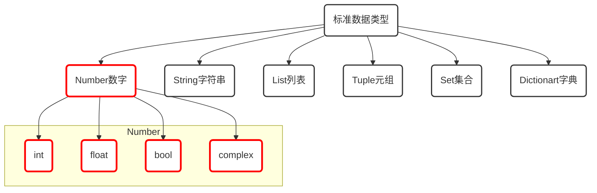
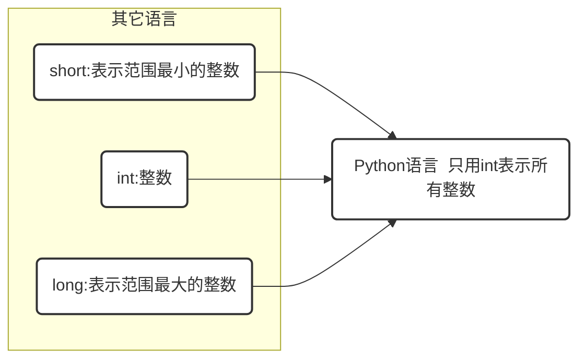
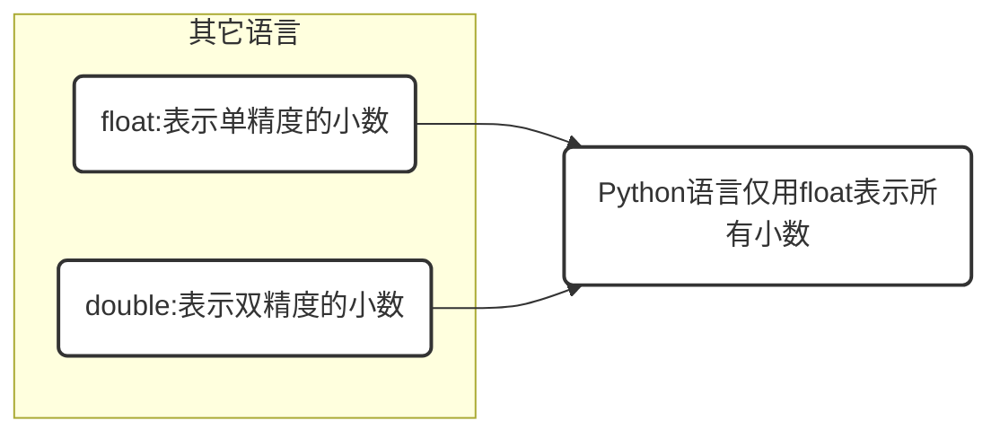
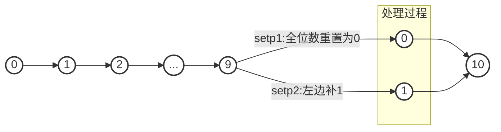
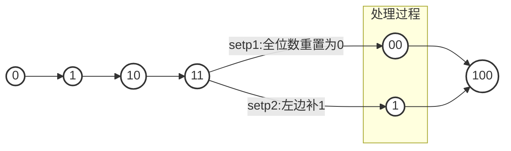
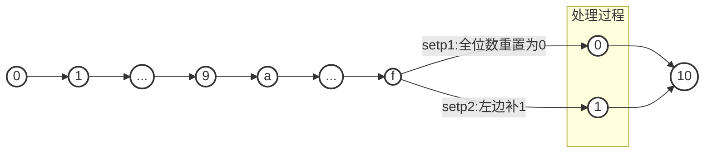

#※ 标准数据类型-Number

[TOC]

##开篇

> 什么是代码

现实世界事物在计算机世界中的映射

> 什么是写代码

用计算机语言来描述现实中的事物

画画\摄影本身就是通过图形轮廓,色彩光影对现实世界中事物进行描述,

所以同样道理,如果我们想要用计算语言对现实进行描述时,这些元素就是计算语言的标准数据类型.




- **不可变数据（3 个）：**Number（数字）、String（字符串）、Tuple（元组）；
- **可变数据（3 个）：**List（列表）、Dictionary（字典）、Set（集合）。


#1. Number(数字)

##  1.1 整数 `int`

整数值，可正数亦可复数，无小数。 3.x 整型是没有限制大小的，可以当作 Long 类型使用，所以 3.x 没有 2.x 的 Long 类型。 

通过type()函数,了解什么是int型,

根据整数所能表示的范围在其它语言中会划分`short`,`int`,`long`这本种类型,

在python里面,只用`int`类型来表达所有整数.


```python
type(1) #int类型
```

## 1.2 浮点数 `float`

其它语言分单精度(float),双精度(double)类型.,而python里面只有flaot类型(相当于其它语言的float),

> *精度越高所能表示的数值就越准确.*



```python
type(1.0)	#float类型
```

###示例  `int float`

```python
#run python 3.6
type(1)			#int
type(1.1)		#float
type(1+1)		#int
type(1+1.0)		#float
type(1*1)		#int
type(1*1.0)		#float
type(1/1)		#float
type(1//1)		#int

'''
python3 not python2
一些错误的类推例子
1//1 为int类型,是否表示4.5//3 也是int类型,答案是错的
'''
type(4.5//3)
'''
注意:整除仅对两个int类型的数值为效

至于,怎么两数值相除怎么取int类型(或float类型)的方法<调用int()函数即可>,往后章节再谈
'''
```


##1.3 进制型

###1.3.1 `满10进1`10进制



###1.3.2 `满2进1`2进制



###1.3.3 `满8进1`8进制


###1.3.4 `满16进1`16进制



| 方法  | 作用                   |
| ----- | :--------------------- |
| bin() | 任意数转换为2进制数值  |
| oct() | 任意数转换为8进制数值  |
| int() | 任意数转换为10进制数值 |
| hex() | 任意数转换为16进制数值 |

| 表示形式 | 例子  | 作用                                     |
| -------- | ----- | :--------------------------------------- |
| **0b**   | 0b100 | 2进制数值表示方式,相当于10进制的**4**    |
| **0o**   | 0o100 | 8进制数值表示方式,相当于10进制的**64**   |
| 无       | 100   | 10进制`(非常熟悉)`                       |
| **0x**   | 0x100 | 16进制数值表示方式,相当于10进制的**256** |


##1.4 布尔类型 `bool`

| 类型  | 数值 |
| ----- | ---- |
| True  | 1    |
| False | 0    |
| None  | 空   |

方法:

```python
bool(1)			#True
bool(0)			#False 
bool('')		#False 	空字符
bool('1')		#True 	字符
bool([])		#False 	空列表
bool([1,2])		#True 	列表
bool(set())		#False 	空集合
bool({1,2})		#True 	集合
bool({})		#False	空字典
bool({"2":3})	#True	字典
```


## 1.5 复数 `complex`

复数由实数部分和虚数部分构成，可以用 a + bj ，或者 complex(a,b) 表示，复数的实部 a 和虚部 b 都是浮点型。 

```python
a,b=1,8
a + bj 
```

没必要深入学习了解,有需要时再学习.
