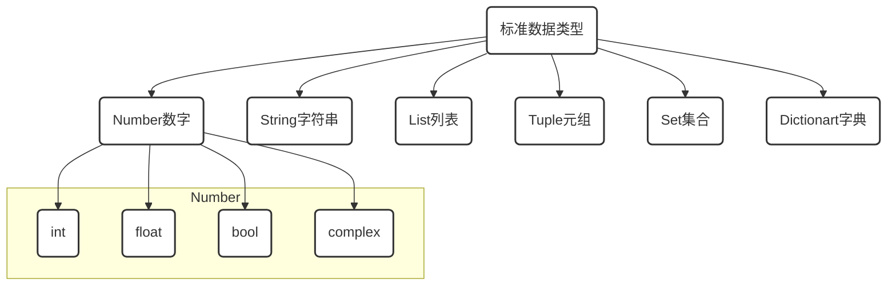

# ※ 标准数据类型-String

[TOC]

## 开篇

> 什么是代码

现实世界事物在计算机世界中的映射

> 什么是写代码

用计算机语言来描述现实中的事物

画画\摄影本身就是通过图形轮廓,色彩光影对现实世界中事物进行描述,

所以同样道理,如果我们想要用计算语言对现实进行描述时,这些元素就是计算语言的标准数据类型.



- **不可变数据（3 个）：**Number（数字）、String（字符串）、Tuple（元组）；
- **可变数据（3 个）：**List（列表）、Dictionary（字典）、Set（集合）。


# 2.字符串 `String`

```python
'abc' # 单引号

"let's" # 如果语句中带有单引号,可使用双引号

'''
a
b
'''# 3单引号可使语句分段表示

"""
a
b
"""# 3双引号可使语句分段表示

text='a\nb' #反斜杠\n表示换行 转义字符
print(text)

text='a\\nb' # 当我们需要输出反斜杠符号时,可以使用双反斜杠
print(text)

text=r'a\nb' # 也可以全用原始字符串符号r 或 R
print(text)
```

## 2.1 字符串运算

| 操作符   | 描述                                                         | 实例             | 结果     |
| -------- | ------------------------------------------------------------ | ---------------- | -------- |
| +        | 字符串连接                                                   | 'abc'+'def'      | ’abcdef‘ |
| *        | 重复输出字符串                                               | 'a'*2            | 'aa'     |
| []       | 通过索引获取字符串中字符                                     | 'abcdef'[2]      | 'c'      |
| [:]      | 截取字符串中的一部分                                         | 'abcdef'[1:2]    | 'bc'     |
| [:步长]  | 指定步长截取字符串中的一部分                                 | 'abcdef'[1:5:2]  | 'bd'     |
| in       | 成员运算符 - 如果字符串中包含给定的字符返回 True             | 'a' in 'abc'     | True     |
| not in   | 成员运算符 - 如果字符串中不包含给定的字符返回 True           | 'a' not in 'abc' | False    |
| r<br />R | 原始字符串：所有的字符串都是直接按照字面的意思来使用，没有转义特殊或不能打印的字符。 |                  |          |
| %        | 格式字符串                                                   |                  |          |

## 2.2python字符串格式化符号:

| 符   号 | 描述                                 |
| :-----: | ------------------------------------ |
|   %c    | 格式化字符及其ASCII码                |
|   %s    | 格式化字符串                         |
|   %d    | 格式化整数                           |
|   %u    | 格式化无符号整型                     |
|   %o    | 格式化无符号八进制数                 |
|   %x    | 格式化无符号十六进制数               |
|   %X    | 格式化无符号十六进制数（大写）       |
|   %f    | 格式化浮点数字，可指定小数点后的精度 |
|   %e    | 用科学计数法格式化浮点数             |
|   %E    | 作用同%e，用科学计数法格式化浮点数   |
|   %g    | %f和%e的简写                         |
|   %G    | %f 和 %E 的简写                      |
|   %p    | 用十六进制数格式化变量的地址         |

###  python snippet (格式化输出)

```python
a="Hello"
b="word"
print(这是%s,%(a+b))
```

## 2.3 字符串本身是序列，可以通过索引号抽取字符

### 索引或切片时会用到内容


```python
'abcdef'[0]		#输出a
```

```python
'abcdef'[-2]	#输出e	
```

```python
'abcdef'[:3]	#输出abc	
```

```python
'abcdef'[-5:-3]	#输出bc
```

```python
'abcdef'[:]		#输出abcdef
```

```python
'abcdef'[::]	#输出abcdef
```

```python
'abcdef'[:-2:2]	#获取0到-2位置之间的字符串,以步长为2进行截取,结果是ac
```

## 2.4 string 字符串 内置函数

```python
help(str) #help详细了解string内置函数

text=' a-b-A-c-a '

text.upper() # 全部大写

text.lower() # 全部小写

text.swapcase() # 大小写互换

text.capitalize() # 首字母大写,其余小写

text.title() # 首字母大写

text.ljust(10) # 获取固定长度,左对齐,右边不够用空格补齐

text.rjust(10) # 获取固定长度,右对齐,左边不够用空格补齐

text.center(10) # 获取固定长度,中间对齐,两边不够用空格补齐

text.zfill(10) # 获取固定长度,右对齐,左边不足用0补齐

text.find('a') # 搜索指定字符串,找到返回0，没有返回-1

text.index('a') # 同上,找到返回0,但是找不到会报错

text.rfind('f') # 从右边开始查找,找到返回0，没有返回-1

text.count('a') # 统计指定的字符串出现的次数

text.replace('a','new') # 替换a为new,默认替换次数1

text.replace('a','new',2) # 替换a为new,第三个参数指定替换次数

text.strip() # 去两边空格

text.lstrip() # 去左边空格

text.rstrip() # 去右边空格

text.split() # 默认按空格分隔

text.split('-') # 按指定字符分割字符串为列表List

text.startswith('start') # 是否以start开头

text.endswith('end') # 是否以end结尾

text.isalpha() # 是否全字母

text.isdigit() # 是否全数字

text.islower() # 是否全小写

text.isupper() # 是否全大写

text.istitle() # 判断首字母是否为大写

text.isspace() # 判断字符是否为空格
```


