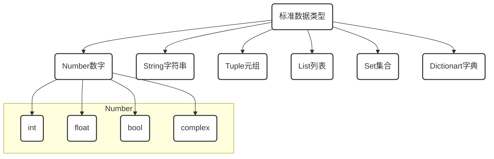

# ※ 标准数据类型-Tuple

[TOC]

## 开篇

> 什么是代码

现实世界事物在计算机世界中的映射

> 什么是写代码

用计算机语言来描述现实中的事物

画画\摄影本身就是通过图形轮廓,色彩光影对现实世界中事物进行描述,

所以同样道理,如果我们想要用计算语言对现实进行描述时,这些元素就是计算语言的标准数据类型.



- **不可变数据（3 个）：**Number（数字）、String（字符串）、Tuple（元组）；
- **可变数据（3 个）：**List（列表）、Dictionary（字典）、Set（集合）。

# 3. 元组 `Tuple`

```python
() # 创建空元组时,一个小括号即可

('0') # 本意是想创建一个元素的元组,错误创建是字符串类型

('0',) # 若想创建只有一个元素的元组, 需要加上逗号以调用方法区分开来

tup=('0', 1, True, 0.11, False, [1]) # 创建了一个元组,变量tup指向该元组的内存地址

```

## 3.1 元组的操作 (元组是序列)

- *序列都可以进行的操作包括索引，切片，加，乘，检查成员* 

| 操作符  | 描述                                             | 实例            | 结果        |
| ------- | ------------------------------------------------ | --------------- | ----------- |
| +       | 对象连接                                         | (1,20)+(2,3)    | (1,20,2,3)  |
| *       | 重复输出对象                                     | (1,20)*2        | (1,20,1,20) |
| []      | 通过索引获取对象中字符                           | (1,20)[0]       | '1'         |
| [:]     | 截取对象中的一部分                               | (1,20)[1:2]     | (20,)       |
| [:步长] | 指定步长截取对象中的一部分                       | (1,20)[1:5:2]   | (20,)       |
| in      | 成员运算符 - 如果对象中包含给定的字符返回 True   | 1 in (1,20)     | True        |
| not in  | 成员运算符 - 如果对象中不包含给定的字符返回 True | 1 not in (1,20) | False       |

## 3.2 元组本身是序列，可以进行索引与切片

```python
tup[-5] #反向索引成员值

tup[1:3] #以切片的方式截取成员

tup[-5:-3] #以切片的方式截取成员

tup[1:5:2] #以步长为2在选值范围内进行切片

for x in tup: print(x,end=',') #可以通过迭代方法遍历元组成员

print(tup+tup) #元组的加法操作

print(tup*4) #元组的乘法操作

1 in tup #检查成员操作

1 not in tup #检查成员操作

del(tup) #通过del()方法删除元组
```

## 3.3 Tuple 内置函数

```python
tup=(1,2,3)
tup.index(1) #如果传入参数在元组中,则返回索引号,否则抛出异常
tup.count(1) #传入参数在元组中则返回1,否则返回0
```


