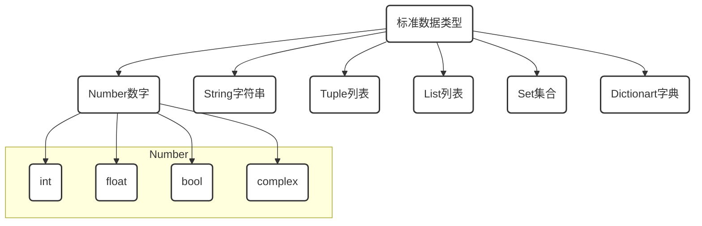

# ※ 标准数据类型-List

[TOC]

## 开篇

> 什么是代码

现实世界事物在计算机世界中的映射

> 什么是写代码

用计算机语言来描述现实中的事物

画画\摄影本身就是通过图形轮廓,色彩光影对现实世界中事物进行描述,

所以同样道理,如果我们想要用计算语言对现实进行描述时,这些元素就是计算语言的标准数据类型.



- **不可变数据（3 个）：**Number（数字）、String（字符串）、Tuple（列表）；
- **可变数据（3 个）：**List（列表）、Dictionary（字典）、Set（集合）。

# 4. 列表 `List`

```python
[] #创建一个列表list

['a', 1, True, 0.11, False, [1]] #方括号,元素之间以逗号隔开

list1=['a', 1, True, 0.11, False, [1]] # 创建一个list列表赋值给变量list1

type(list1) #检查list1的类型
```

## 4.1 列表的操作 (列表是序列)

- *序列都可以进行的操作包括索引，切片，加，乘，检查成员* 

| 操作符  | 描述                                             | 实例            | 结果        |
| ------- | ------------------------------------------------ | --------------- | ----------- |
| +       | 对象连接                                         | [1,20]+[2,3]   | [1,20,2,3] |
| *       | 重复输出对象                                     | [1,20]*2      | [1,20,1,20] |
| []      | 通过索引获取对象中字符                           | [1,20][0]    | 1         |
| [:]     | 截取对象中的一部分                               | [1,20\][1:2]  | 20    |
| [:步长] | 指定步长截取对象中的一部分                       | [1,20\][1:5:2] | 20     |
| in      | 成员运算符 - 如果对象中包含给定的字符返回 True   | 1 in [1,20]   | True        |
| not in  | 成员运算符 - 如果对象中不包含给定的字符返回 True | 1 not in [1,20] | False       |

## 4.2 列表本身是序列，可以进行索引与切片

```python
list1=['0', 1, True, 0.11, False, [1]]

list1[0] #正向索引成员值

list1[0]=3  #列表允许修改成员值
print(list1)

list1.append('b') #列表有提供增加成员的方法
print(list1)

del(list1[-1]) #列表允许删除成员
print(list1)

list1[-5] #反向索引成员值

list1[1:3] #以切片的方式截取成员

list1[-5:-3] #以切片的方式截取成员

list1[1:5:2] #以步长为2在选值范围内进行切片

for x in list1:print(x,end=',') #可以通过迭代方法遍历列表成员

print(list1+list1) #元组的加法操作

print(list1*4) #元组的乘法操作

1 in list1 #检查成员操作

1 not in list1 #检查成员操作

del(list1) #通过del()方法删除元组

del(tup) #通过del()方法删除列表
```

## 4.3 List 列表内置函数

```python
list1=['a', 1,'a', 0.11, False, [1,1]]

list1.append('e') # 在列表末尾添加新的对象
print(list1)

list1.count(1) # 统计某个元素在列表中出现的次数

list1.extend(['2',2]) # 在列表末尾一次性追加另一个序列中的多个值（用新列表扩展原来的列表）
print(list1)

list1.index('a') # 从列表中找出某个值第一个匹配项的索引位置

list1.insert(2, 'obj') # 将对象插入列表,第一个参数为索引号,第二个参数是对象
print(list1)

list1.remove('obj') # 移除列表中某个值的第一个匹配项
print(list1)

list1.reverse() # 反向列表中元素
print(list1)

list1.clear() # 清空列表

list2=list1.copy() # 复制列表,这是新增内存地址的复制

id(list2) == id(list1) # 判断list2与list1的内存地址是否一样

list2=list1 # 如果用list2=list1,这样赋值方式,list2仅表示指向list1的内存地址

id(list2) == id(list1) # 此时list2与list1的内存地址是一样的
```


