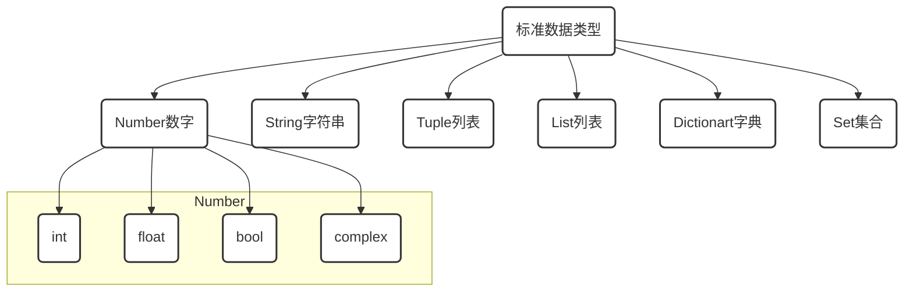

# ※ 标准数据类型-Dict

[TOC]

## 开篇

> 什么是代码

现实世界事物在计算机世界中的映射

> 什么是写代码

用计算机语言来描述现实中的事物

画画\摄影本身就是通过图形轮廓,色彩光影对现实世界中事物进行描述,

所以同样道理,如果我们想要用计算语言对现实进行描述时,这些元素就是计算语言的标准数据类型.



- **不可变数据（3 个）：**Number（数字）、String（字符串）、Tuple（列表）；
- **可变数据（3 个）：**List（列表）、Dictionary（字典）、Set（集合）。

# 5. 字典`Dict`

```python
{} #创建一个空字典

{'a':1,'b':0.2,'c':True,'d':'hello'} #创建一个带有键值对的字典

dict1 = {'a':1,'b':0.2,'c':True,'d':'hello'} # 创建一个dict字典并赋值给变量dict1

type(dict1)
```

## 5.1 字典的操作 (字典是`无序`的)

- 字典只能通过key值,取值
- ~~dict1[-5]~~ #字典(dict)是无序的,不支持索引
- ~~dict1[1:3]~~ 字典(dict)是无序的,不支持切片操作
- ~~dict1+dict1~~  字典不支持加法操作
- ~~dict1*4~~  字典不支持乘法操作

| 操作符 | 描述                                             | 实例                    | 结果  |
| ------ | ------------------------------------------------ | ----------------------- | ----- |
| in     | 成员运算符 - 如果对象中包含给定的字符返回 True   | 1 in {'a':1,'b':20}     | True  |
| not in | 成员运算符 - 如果对象中不包含给定的字符返回 True | 1 not in {'a':1,'b':20} | False |

## 5.2 字典本身是序列，可以进行索引与切片

```python
dict1={'a':1,'b':0.2,'c':True,'d':'hello'}

dict1['a'] #可通过key值索引vlaue值

dict1['a']='new' #字典允许修改成员值
print(dict1)

dict1['new']='python' #列表有提供增加成员的方法
print(dict1)

del(dict1['new']) #列表允许删除成员
print(dict1)

for x in dict1: print(x,end=',') #可以通过迭代方法遍历dict字典得到key值

for x in dict1:  print(dict1[x],end=',') #可以通过迭代方法遍历dict字典得到vlaue值

1 in dict1 #检查成员操作

1 not in dict1 #检查成员操作

del(dict1) #通过del()方法删除元组
```

## 5.3 Ditct 字典内置函数

```python
dict1={'a':1,'b':0.2,'c':True,'d':'hello'}
dict1.get('a', '3') #返回指定键(第一个参数)的vlaue值，如果key值不在字典中返回第二参数,default=None

dict1.setdefault('key', 3) #和get()类似, 但如果键不存在于字典中，将会添加键并将值设为第二参数
print(dict1)

dict1.fromkeys([3,2],'a') 
#创建一个新字典,以序列中元素做字典的key键,第二个参数为字典所有键对应的初始值

dict2=dict1.copy() #返回一个字典的浅复制(对复制后的对象进行操作不对原对象产生影响)
print(dict2)

dict2.clear() #清空字典
print(dict2,dict1) #打印复制对象与原对象

dicitems=dict1.items() #以列表返回可遍历的(key键,value值)元组数组
print(dicitems)

for x in dicitems: print(x) #只能以遍历的方式对dicitem进行访问

dickeys=dict1.keys() 
print(dickeys)#以列表返回一个字典所有的key键

for x in dickeys: print(x) #同样,也只能以遍历的方式对dickeys进行访问

dicvalues=dict1.values() #以列表返回一个字典所有的value键
print(dicvalues)

for x in dicvalues:print(x) #同样,也只能以遍历的方式对dicvalues进行访问

dict2={'a':3,'g':3}
dict2.update(dict1) #将dict1的键值对更新dict2中，
print(dict2)

dict2.pop('a','e') #删除字典给定键key所对应的值,返回值为被删除的value值,否则,返回第二参数的值。

dict2.popitem() #随机返回并删除字典中的一对键和值(一般删除末尾对)。
```


