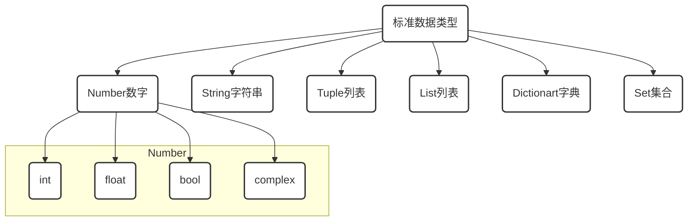

# ※ 标准数据类型-Set

[TOC]

## 开篇

> 什么是代码

现实世界事物在计算机世界中的映射

> 什么是写代码

用计算机语言来描述现实中的事物

画画\摄影本身就是通过图形轮廓,色彩光影对现实世界中事物进行描述,

所以同样道理,如果我们想要用计算语言对现实进行描述时,这些元素就是计算语言的标准数据类型.



- **不可变数据（3 个）：**Number（数字）、String（字符串）、Tuple（列表）；
- **可变数据（3 个）：**List（列表）、Dictionary（字典）、Set（集合）。

# 6. 集合`Set`

```python
set() #创建一个空集合

{1,'2',False,(1,3)} #花括号之内元素之间以逗号隔开

set1={1,'2',False,(1,3)}  # 创建一个set集合赋值给变量set1

type(set1) #检查list1的类型
```

## 6.1 集合的操作 (集合是`无序`的)

- ~~set1[0]~~  集合(set)不支持索引成员值
- ~~set1[2:-1]~~  集合(set)不支持切片操作
- ~~set[0]=3~~ 集合(set)不支持修改成员值

| 操作符 | 描述                                             | 实例            | 结果  |
| ------ | ------------------------------------------------ | --------------- | ----- |
| in     | 成员运算符 - 如果对象中包含给定的字符返回 True   | 1 in {1,20}     | True  |
| not in | 成员运算符 - 如果对象中不包含给定的字符返回 True | 1 not in {1,20} | False |

## 6.2 字典本身是序列，可以进行索引与切片

```python
set1.update('b') #集合(set)允许增加成员
print(set1)

set1.remove('b') #集合(set)允许删除成员
print(set1)

for x in set1:print(x,end=',') #可以通过迭代方法遍历集合(set)成员

set1={1,'2',False,(1,3)}
set2={1,'2',False,(1,3),3}
print(set2-set1) #元组的求差操作,必须是大的集合减小集合

print(set2|set1) #集合set1与set2的所有元素

print(set2 & set1) #集合set1与set1都包含的元素

print(set2 ^ set1) #集合set1与set1不同时包含的元素

1 in set1 #检查成员操作

1 not in set1 #检查成员操作

del(set1) #通过del()方法删除集合
```

## 6.3 Ditct 字典内置函数

```python
help(set) #通过help查看set内置函数

set1=set(('old',))
set2=set1.copy() #将集合set1复制到新的集合set2中
print(id(set1),id(set2))

set1=set(('old',))
set1.add('new') # 增加一个元素到集合set中
print(set1)

set1={'old', 'new'}
set2={'s','old'}
set.difference(set1,set2) # 输出set1包含,但set2不包含的成员值

set1={'old', 'new'}
set2={'s','old'}
set.difference_update(set1,set2) # set1包含,但set2不包含的成员值,并更新set1为该值
print(set1)

set1={'old', 'new','s'}
set1.discard('s') # 传入指定的值,如果集合中包含该值则删除该成员,如果没有则不抛异常
print(set1)

set1={'old', 'new'}
set2={'s','old'}
set3=set.intersection(set1,set2) #返回set1与set2相同值的新集合
print(set3)

set1={'old', 'new'}
set2={'s','old'}
set.intersection_update(set1,set2) #得到set1与set2的相同值并更新set1
print(set1)

set1={'old', 'new'}
set2={'s','old'}
set.isdisjoint(set1,set2) #判断set1与set2是否无交集

set1={'old', 'new','ds'}
set2={'old', 'new'}
set.issubset(set1,set2) #判断set1是否从属于set2

set1={'old', 'new','ds'}
set2={'old', 'new'}
set.issuperset(set1,set2) #判断set1是否包含set2

set1={'old', 'new','ds'}
set1.pop() #随机删除一个成员
print(set1)

set1={'old', 'new','s'}
set1.remove('s') # 传入指定的值,如果集合中包含该值则删除该成员,如果没有则抛出异常
print(set1)

set1={'old', 'new'}
set2={'s','old'}
set3=set.symmetric_difference(set1,set2) #返回去掉set1与set2相同值的新集合set
print(set3)

set1={'old', 'new'}
set2={'s','old'}
set.symmetric_difference_update(set1,set2) #得到去掉set1与set2相同值的集合并更新set1
print(set1)

set1={'old', 'new'}
set2={'s','old'}
set3=set.union(set1,set2) #将set1与set2合并
print(set3)

set1={'old', 'new'}
set2={'s','old'}
set.update(set1,set2) #将set1与set2合并,并更新set1的值
print(set1)
```


