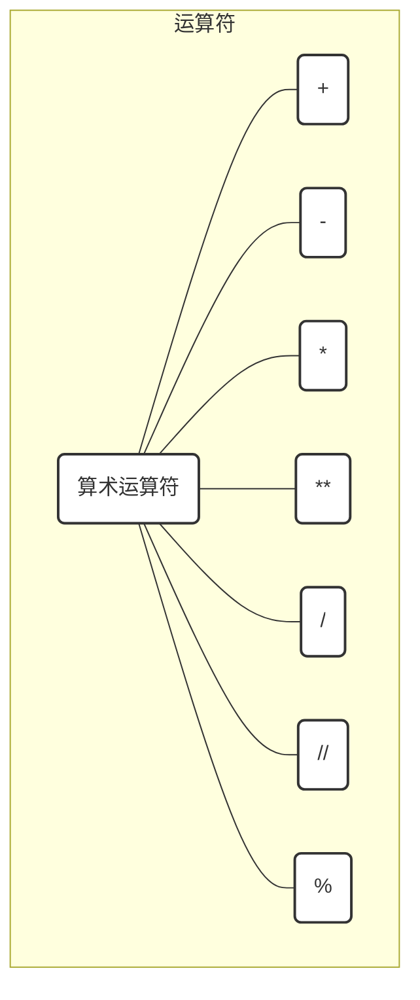
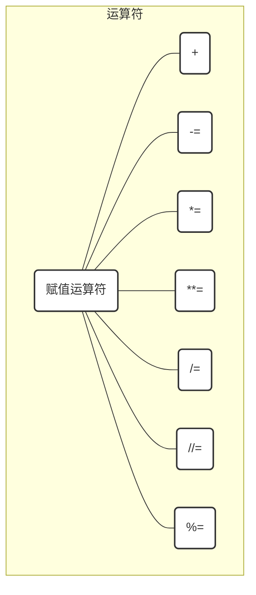
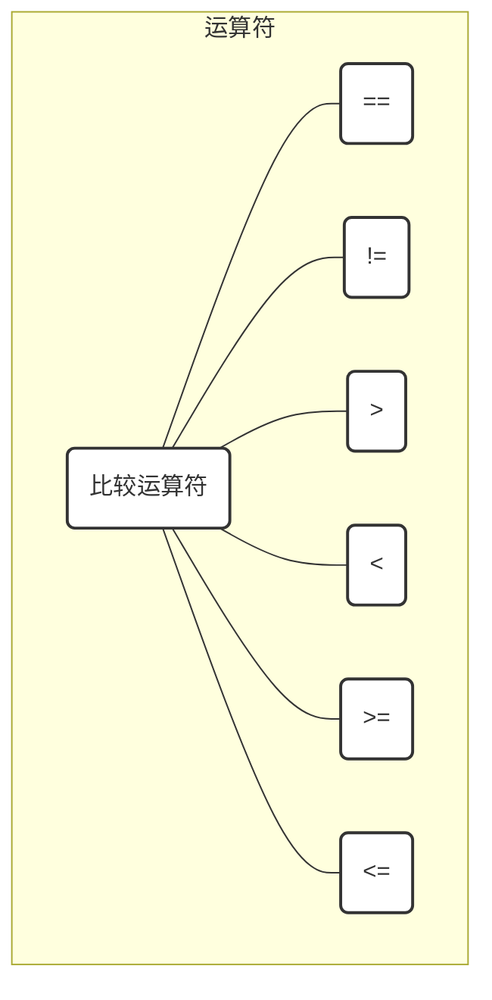
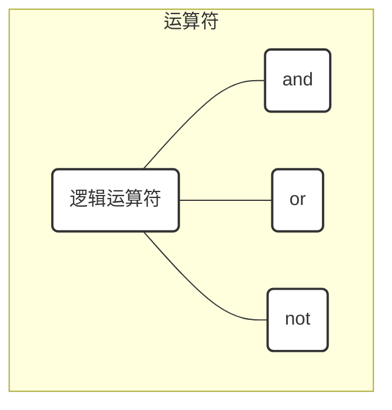
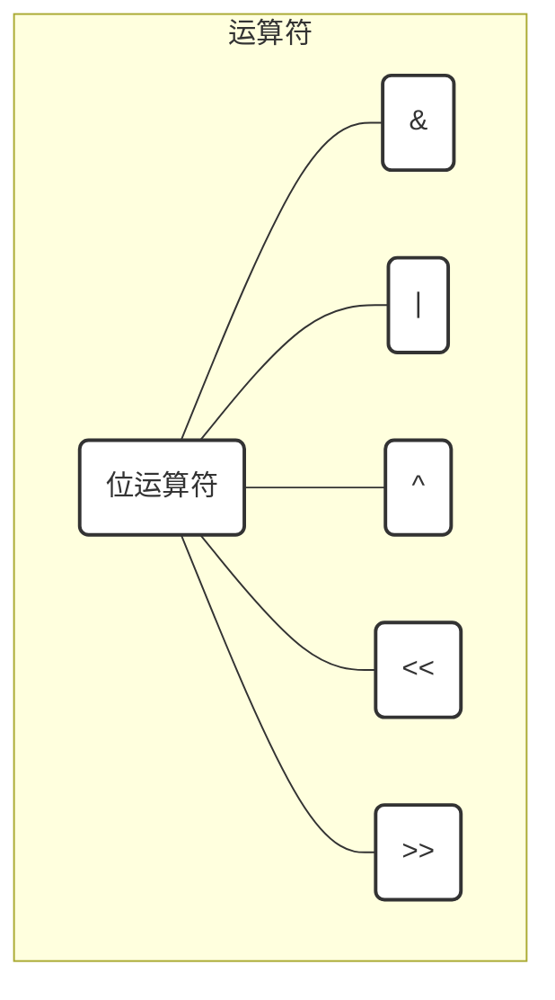
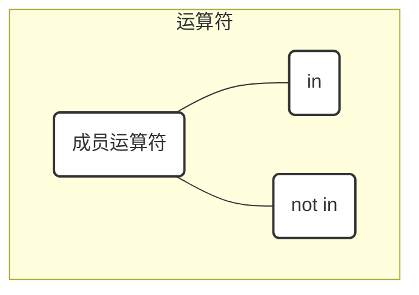
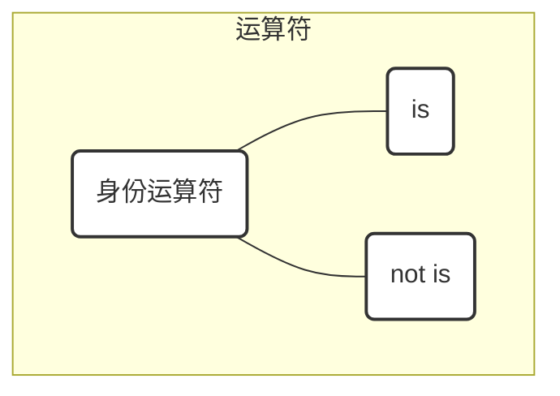

#※ Python3 运算符

[TOC]


#2. 运算符

##  2.1 算术运算符


```python
x,y,z=1,2,3

x+y #加 - 两个对象相加

x-y #减 - 得到负数或是一个数减去另一个数

x*y #乘 - 两个数相乘或是返回一个被重复若干次的字符串

x/y #除 - x 除以 y

x % y #取模 - 返回除法的余数

y ** z # 幂 - 返回x的y次幂

z//y #取整除 - 返回商的整数部分
```


## 2.2 赋值运算符


```python
x = 8
y = 2
x += y #一个比较好理解的叫法叫自增y,相当于x=x+y
print(x)

x = 8
y = 2
x -= y #自减y,相当于x=x-y
print(x)

x = 8
y = 2
x *= y #自乘y,相当于x=x*y
print(x)

x = 8
y = 2
x /= y #自除y,相当于x=x/y
print(x)

x = 8
y = 2
x %= y #自取模y,相当于x=x%y
print(x)

x = 8
y = 2
x **= y #自幂y,相当于x=x**y
print(x)

x = 8
y = 2
x //= y #自取整除y,相当于x=x//y
print(x)
```


## 2.3 比较(关系)运算符


```python
x,y,z=1,2,3

x == y #比较对象是否相等

x != y #比较两个对象是否不相等

x > y #返回x是否大于y

x < y #返回x是否小于y

x >= y  #返回x是否大于等于y。

x <= y #返回x是否小于等于y
```


## 2.4 逻辑运算符



```python
- and 布尔'与'运算.如果左边值为空,结果返回为左边值,否则返回右边值

0 and 1 

False and 1

'' and 1 

()  and 1

[] and 1

{} and 1

set() and 1
```

- or 布尔'或'运算.如果左边非空,结果返回为左边值,否则返回右边值

```python
1 or 'a'

True or ''

'1' or ''

(1,) or ''

[1] or ''

{'a':1} or ''

set('123') or '' 
```

- not 布尔"非",如果右边为非空，返回False 。如果右边为空，它返回True。

```python
not 0

not False

not ''

not ()

not []

not {}

not set()
```


## 2.5 位运算符



- & 按位与运算符：参与运算的两个值,如果两个相应位都为1,则该位的结果为1,否则为0
```python
{1,2,3} & {3,5,6,7} #表示两集合的交集

a = 0b11100101
b = 0b10111001
bin(a & b)
```
- | 按位或运算符：

  只要对应的二个二进位有一个为1时，结果位就为1。
```python
{1,2,3} | {3,5,6,7} #表示两集合的并集

a = 0b11100101
b = 0b10111001
bin(a | b)
```
- ^ 按位异或运算符：

  当两对应的二进位相异时，结果为1
```python
{1,2,3} ^ {3,5,6,7} #表示两集合并集与交集的差集

a = {1,2,3} | {3,5,6,7} #两集合求并集
b = {1,2,3} & {3,5,6,7} #两集求交集
a-b #两集合作差集

a = 0b1010
b = 0b0110
bin(a^b)
```
- ~按位取反运算符：

  对数据的每个二进制位取反,即把1变为-2,把0变为-1。
```python
a = 0b1010
a = ~a
bin(a)
```
- << 左移动运算符：

  运算数的各二进位全部左移若干位，由"<<"右边的数指定移动的位数，高位丢弃，低位补0。
```python
a = 0b1010
a = a << 2
bin(a)
```
- \>>右移动运算符：把">>"左边的运算数的各二进位全部右移若干位，">>"右边的数指定移动的位数。
```python
a = 0b101100
a = a >> 2
bin(a)
```


## 2.6 成员运算符




- in 如果在指定的序列中找到值返回 True，否则返回 False。
```python
'1' in '123456789'

1 in [1,2,3]

1 in {1,2,3}

'a' in {'a':1,'b':2} #检查key值成员

'1' in set('123456')
```
- not in 如果在指定的序列中没有找到值返回 True，否则返回 False。
```python
'1' not in '123456789'

1 not in [1,2,3]

1 not in {1,2,3}

'a' not in {'a':1,'b':2} #检查key值成员

'1' not in set('123456')
```


## 2.7 身份运算符



- is 是判断两个标识符是不是引用自一个对象
```python
a = [1]
b = a
a is b #判断是否指向同一个内存地址

a == b

print(id(a),id(b)) #两个变量指向的地址一样

a = [1]
b = [1]
a is b

a == b 

print(id(a),id(b)) #两个变量指向的地址不一样，所以身份运算符结果不一致
```
- is not 是判断两个标识符是不是引用自不同对象
```python
a = [1]
b = a
a is not b #判断是否指向同一个内存地址

a != b

print(id(a),id(b)) #两个变量指向的地址一样

a = [1]
b = [1]
a is not  b

a != b 

print(id(a),id(b)) #两个变量指向的地址不一样，所以身份运算符结果不一致
```


